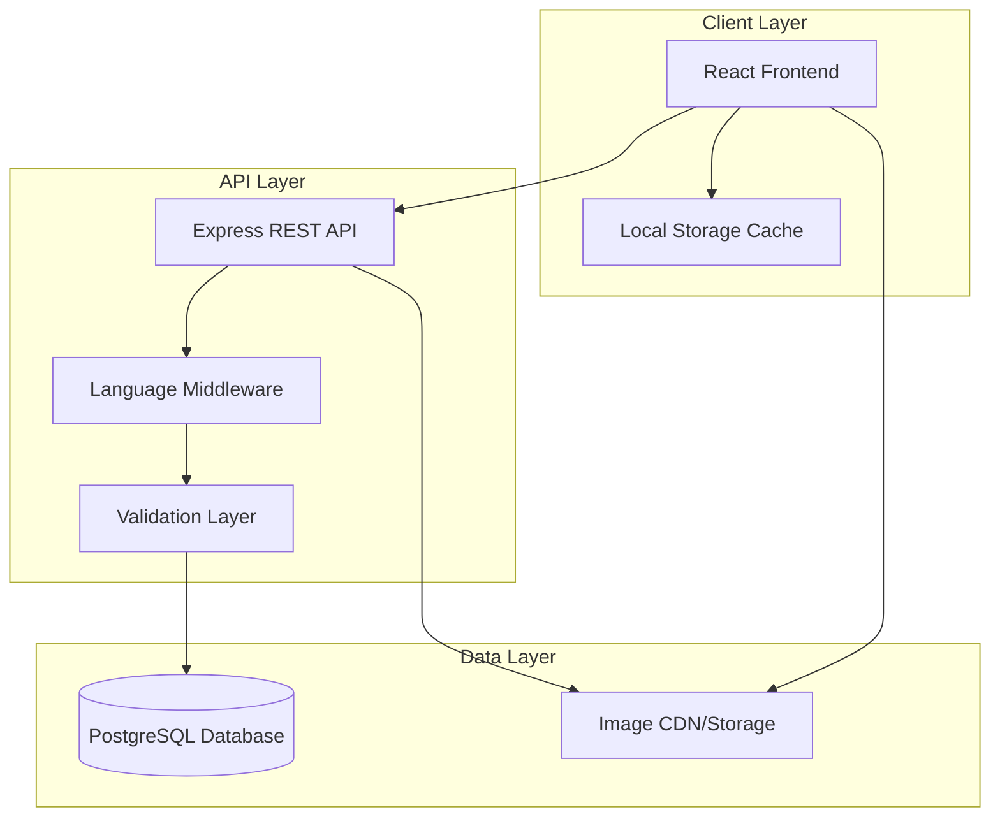
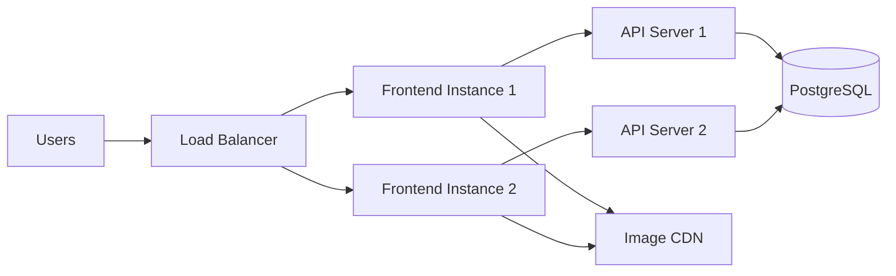
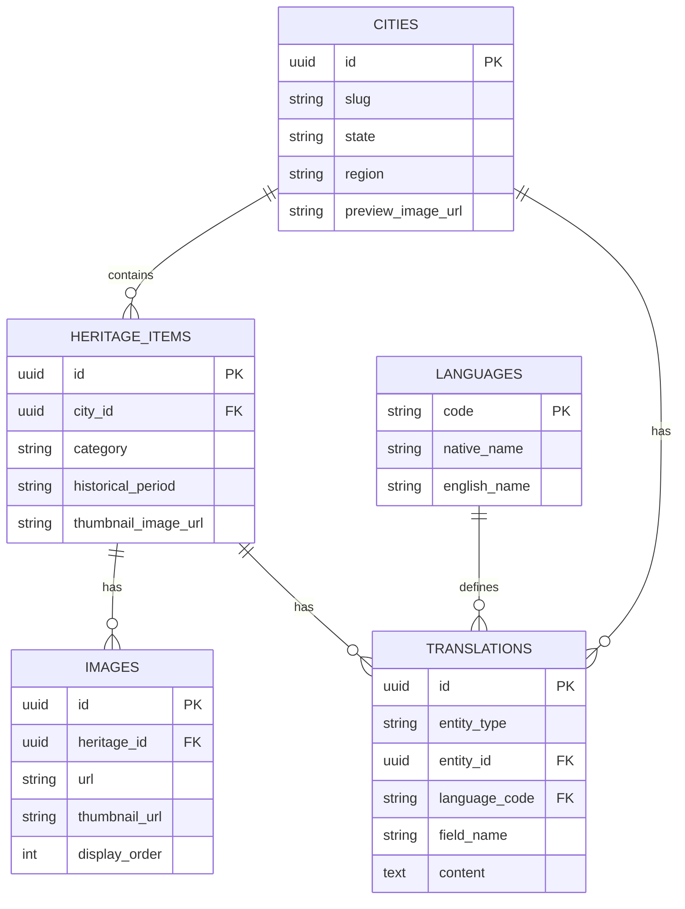

# Design Document: Indian Culture App

## Overview

The Indian Culture App is a full-stack web application that provides an immersive exploration of India's rich cultural heritage. The system enables users to discover cultural facts about all aspects of Indian cities' heritage—including monuments, temples, festivals, traditions, cuisine, art forms, historical events, and local customs—with support for 23 languages (22 official Indian languages plus English).

The application follows a three-tier architecture:
- **Frontend**: React-based single-page application with responsive design
- **Backend**: Node.js/Express REST API server
- **Database**: PostgreSQL with full-text search capabilities

Key design principles:
- Multi-language support as a first-class concern
- Performance optimization through caching and lazy loading
- Scalable architecture supporting concurrent users
- Comprehensive cultural content covering all heritage aspects
- Rich media experience with image galleries

## Architecture

### System Architecture Diagram



### Technology Stack

**Frontend:**
- React 18+ with TypeScript
- React Router for navigation
- Axios for API communication
- i18next for internationalization
- React Query for data fetching and caching
- Tailwind CSS for styling
- React Image Gallery for image display

**Backend:**
- Node.js 18+ with TypeScript
- Express.js for REST API
- Joi for request validation
- Winston for logging
- Node-cache for in-memory caching

**Database:**
- PostgreSQL 15+ for relational data
- pg library for database connectivity
- Full-text search with tsvector

**Infrastructure:**
- AWS S3 or Cloudinary for image storage
- CloudFront or similar CDN for image delivery
- Docker for containerization
- Environment-based configuration

### Deployment Architecture



## Components and Interfaces

### Frontend Components

#### 1. App Component
Root component managing routing and global state.

```typescript
interface AppProps {}

interface AppState {
  selectedLanguage: string;
  isLoading: boolean;
}

// Routes:
// / - Home/City Selection
// /city/:cityId - City Cultural Heritage View
// /heritage/:heritageId - Detailed Heritage View
```

#### 2. LanguageSelector Component
Dropdown with search for selecting from 23 languages.

```typescript
interface LanguageSelectorProps {
  currentLanguage: string;
  onLanguageChange: (languageCode: string) => void;
}

interface Language {
  code: string;        // ISO 639-1 code (e.g., 'en', 'hi', 'ta')
  name: string;        // Native name (e.g., 'English', 'हिन्दी', 'தமிழ்')
  englishName: string; // English name for search
}
```

#### 3. CityList Component
Displays searchable list of all Indian cities with cultural content.

```typescript
interface CityListProps {
  language: string;
  onCitySelect: (cityId: string) => void;
}

interface City {
  id: string;
  name: string;           // Localized name
  state: string;          // Localized state name
  region: string;         // North, South, East, West, Central, Northeast
  previewImage: string;   // URL to preview image
  heritageCount: number;  // Number of heritage items
}
```

#### 4. CityView Component
Displays all cultural heritage aspects for a selected city.

```typescript
interface CityViewProps {
  cityId: string;
  language: string;
}

interface CityData {
  city: City;
  heritageItems: HeritageItem[];
}

interface HeritageItem {
  id: string;
  name: string;              // Localized name
  category: HeritageCategory;
  summary: string;           // Brief amazing fact
  thumbnailImage: string;    // Preview image URL
}

enum HeritageCategory {
  MONUMENTS = 'monuments',
  TEMPLES = 'temples',
  FESTIVALS = 'festivals',
  TRADITIONS = 'traditions',
  CUISINE = 'cuisine',
  ART_FORMS = 'art_forms',
  HISTORICAL_EVENTS = 'historical_events',
  CUSTOMS = 'customs'
}
```

#### 5. HeritageCard Component
Displays a cultural heritage item with expand/collapse functionality.

```typescript
interface HeritageCardProps {
  heritage: HeritageItem;
  language: string;
  onExpand: (heritageId: string) => void;
}

interface HeritageDetail {
  id: string;
  name: string;
  category: HeritageCategory;
  summary: string;
  detailedDescription: string;  // Historical context and reasons
  historicalPeriod: string;     // Time period
  significance: string;         // Cultural significance
  images: Image[];
  isExpanded: boolean;
}

interface Image {
  id: string;
  url: string;
  thumbnailUrl: string;
  caption: string;
  altText: string;
}
```

#### 6. ImageGallery Component
Displays image gallery with lightbox functionality.

```typescript
interface ImageGalleryProps {
  images: Image[];
  initialIndex?: number;
}
```

#### 7. ErrorBoundary Component
Catches and displays user-friendly error messages.

```typescript
interface ErrorBoundaryProps {
  children: React.ReactNode;
}

interface ErrorBoundaryState {
  hasError: boolean;
  error: Error | null;
}
```

### Backend API Endpoints

#### Base URL: `/api/v1`

#### 1. Get All Cities
```
GET /cities?language={languageCode}&state={state}&region={region}

Response:
{
  "cities": [
    {
      "id": "string",
      "name": "string",
      "state": "string",
      "region": "string",
      "previewImage": "string",
      "heritageCount": number
    }
  ]
}
```

#### 2. Get City Heritage Content
```
GET /cities/:cityId/heritage?language={languageCode}&category={category}

Response:
{
  "city": {
    "id": "string",
    "name": "string",
    "state": "string",
    "region": "string"
  },
  "heritageItems": [
    {
      "id": "string",
      "name": "string",
      "category": "string",
      "summary": "string",
      "thumbnailImage": "string"
    }
  ]
}
```

#### 3. Get Heritage Details
```
GET /heritage/:heritageId?language={languageCode}

Response:
{
  "id": "string",
  "name": "string",
  "category": "string",
  "summary": "string",
  "detailedDescription": "string",
  "historicalPeriod": "string",
  "significance": "string",
  "images": [
    {
      "id": "string",
      "url": "string",
      "thumbnailUrl": "string",
      "caption": "string",
      "altText": "string"
    }
  ]
}
```

#### 4. Get Heritage Images
```
GET /heritage/:heritageId/images

Response:
{
  "images": [
    {
      "id": "string",
      "url": "string",
      "thumbnailUrl": "string",
      "caption": "string",
      "altText": "string"
    }
  ]
}
```

#### 5. Get Supported Languages
```
GET /languages

Response:
{
  "languages": [
    {
      "code": "string",
      "name": "string",
      "englishName": "string"
    }
  ]
}
```

### Backend Service Layer

#### 1. CityService
Handles city-related business logic.

```typescript
class CityService {
  async getAllCities(language: string, filters?: CityFilters): Promise<City[]>
  async getCityById(cityId: string, language: string): Promise<City>
  async getCityHeritage(cityId: string, language: string, category?: string): Promise<HeritageItem[]>
}

interface CityFilters {
  state?: string;
  region?: string;
  searchTerm?: string;
}
```

#### 2. HeritageService
Handles cultural heritage content logic.

```typescript
class HeritageService {
  async getHeritageById(heritageId: string, language: string): Promise<HeritageDetail>
  async getHeritageImages(heritageId: string): Promise<Image[]>
  async getHeritageByCategory(cityId: string, category: HeritageCategory, language: string): Promise<HeritageItem[]>
}
```

#### 3. TranslationService
Handles content localization.

```typescript
class TranslationService {
  async getTranslation(contentId: string, contentType: string, language: string): Promise<Translation>
  async getSupportedLanguages(): Promise<Language[]>
  getFallbackLanguage(): string  // Returns 'en'
}

interface Translation {
  language: string;
  content: Record<string, string>;
}
```

#### 4. ImageService
Handles image storage and retrieval.

```typescript
class ImageService {
  async getImageUrl(imageId: string, size: 'thumbnail' | 'full'): Promise<string>
  async uploadImage(file: Buffer, metadata: ImageMetadata): Promise<string>
  async deleteImage(imageId: string): Promise<void>
}

interface ImageMetadata {
  heritageId: string;
  caption: string;
  altText: string;
}
```

## Data Models

### Database Schema

#### Cities Table
```sql
CREATE TABLE cities (
  id UUID PRIMARY KEY DEFAULT gen_random_uuid(),
  slug VARCHAR(255) UNIQUE NOT NULL,
  state VARCHAR(100) NOT NULL,
  region VARCHAR(50) NOT NULL,
  preview_image_url TEXT,
  created_at TIMESTAMP DEFAULT CURRENT_TIMESTAMP,
  updated_at TIMESTAMP DEFAULT CURRENT_TIMESTAMP
);

CREATE INDEX idx_cities_state ON cities(state);
CREATE INDEX idx_cities_region ON cities(region);
```

#### Heritage Items Table
```sql
CREATE TABLE heritage_items (
  id UUID PRIMARY KEY DEFAULT gen_random_uuid(),
  city_id UUID NOT NULL REFERENCES cities(id) ON DELETE CASCADE,
  category VARCHAR(50) NOT NULL,
  historical_period VARCHAR(100),
  thumbnail_image_url TEXT,
  created_at TIMESTAMP DEFAULT CURRENT_TIMESTAMP,
  updated_at TIMESTAMP DEFAULT CURRENT_TIMESTAMP
);

CREATE INDEX idx_heritage_city ON heritage_items(city_id);
CREATE INDEX idx_heritage_category ON heritage_items(category);
```

#### Translations Table
```sql
CREATE TABLE translations (
  id UUID PRIMARY KEY DEFAULT gen_random_uuid(),
  entity_type VARCHAR(50) NOT NULL,  -- 'city', 'heritage', etc.
  entity_id UUID NOT NULL,
  language_code VARCHAR(10) NOT NULL,
  field_name VARCHAR(50) NOT NULL,   -- 'name', 'summary', 'description', etc.
  content TEXT NOT NULL,
  search_vector tsvector,
  created_at TIMESTAMP DEFAULT CURRENT_TIMESTAMP,
  updated_at TIMESTAMP DEFAULT CURRENT_TIMESTAMP,
  UNIQUE(entity_type, entity_id, language_code, field_name)
);

CREATE INDEX idx_translations_entity ON translations(entity_type, entity_id, language_code);
CREATE INDEX idx_translations_search ON translations USING GIN(search_vector);
```

#### Images Table
```sql
CREATE TABLE images (
  id UUID PRIMARY KEY DEFAULT gen_random_uuid(),
  heritage_id UUID NOT NULL REFERENCES heritage_items(id) ON DELETE CASCADE,
  url TEXT NOT NULL,
  thumbnail_url TEXT NOT NULL,
  display_order INTEGER NOT NULL DEFAULT 0,
  created_at TIMESTAMP DEFAULT CURRENT_TIMESTAMP,
  updated_at TIMESTAMP DEFAULT CURRENT_TIMESTAMP
);

CREATE INDEX idx_images_heritage ON images(heritage_id);
```

#### Languages Table
```sql
CREATE TABLE languages (
  code VARCHAR(10) PRIMARY KEY,
  native_name VARCHAR(100) NOT NULL,
  english_name VARCHAR(100) NOT NULL,
  is_active BOOLEAN DEFAULT true,
  created_at TIMESTAMP DEFAULT CURRENT_TIMESTAMP
);

-- Seed data for 23 languages
INSERT INTO languages (code, native_name, english_name) VALUES
  ('en', 'English', 'English'),
  ('hi', 'हिन्दी', 'Hindi'),
  ('bn', 'বাংলা', 'Bengali'),
  ('te', 'తెలుగు', 'Telugu'),
  ('mr', 'मराठी', 'Marathi'),
  ('ta', 'தமிழ்', 'Tamil'),
  ('gu', 'ગુજરાતી', 'Gujarati'),
  ('kn', 'ಕನ್ನಡ', 'Kannada'),
  ('ml', 'മലയാളം', 'Malayalam'),
  ('or', 'ଓଡ଼ିଆ', 'Odia'),
  ('pa', 'ਪੰਜਾਬੀ', 'Punjabi'),
  ('as', 'অসমীয়া', 'Assamese'),
  ('ks', 'कॉशुर', 'Kashmiri'),
  ('kok', 'कोंकणी', 'Konkani'),
  ('mni', 'মৈতৈলোন্', 'Manipuri'),
  ('ne', 'नेपाली', 'Nepali'),
  ('sa', 'संस्कृतम्', 'Sanskrit'),
  ('sd', 'سنڌي', 'Sindhi'),
  ('ur', 'اردو', 'Urdu'),
  ('brx', 'बड़ो', 'Bodo'),
  ('sat', 'ᱥᱟᱱᱛᱟᱲᱤ', 'Santhali'),
  ('mai', 'मैथिली', 'Maithili'),
  ('doi', 'डोगरी', 'Dogri');
```

### Data Relationships



### Translation Strategy

All user-facing text content is stored in the `translations` table with the following structure:

**City Translations:**
- entity_type: 'city'
- entity_id: city UUID
- field_name: 'name', 'state'

**Heritage Translations:**
- entity_type: 'heritage'
- entity_id: heritage_item UUID
- field_name: 'name', 'summary', 'detailed_description', 'significance'

**Image Translations:**
- entity_type: 'image'
- entity_id: image UUID
- field_name: 'caption', 'alt_text'

**Fallback Logic:**
1. Query for content in requested language
2. If not found, query for English ('en')
3. If still not found, return error

## Multi-Language Implementation

### Frontend Internationalization

Using i18next for UI strings and API responses for content:

```typescript
// i18n configuration
import i18n from 'i18next';
import { initReactI18next } from 'react-i18next';

i18n
  .use(initReactI18next)
  .init({
    resources: {
      en: {
        translation: {
          'app.title': 'Indian Culture App',
          'city.select': 'Select a City',
          'heritage.more': 'More',
          'heritage.less': 'Less',
          'error.loading': 'Failed to load content'
        }
      },
      hi: {
        translation: {
          'app.title': 'भारतीय संस्कृति ऐप',
          'city.select': 'एक शहर चुनें',
          'heritage.more': 'अधिक',
          'heritage.less': 'कम',
          'error.loading': 'सामग्री लोड करने में विफल'
        }
      }
      // ... other languages
    },
    lng: 'en',
    fallbackLng: 'en',
    interpolation: {
      escapeValue: false
    }
  });
```

### Backend Language Handling

```typescript
// Language middleware
export const languageMiddleware = (req: Request, res: Response, next: NextFunction) => {
  const language = req.query.language as string || req.headers['accept-language'] || 'en';
  const supportedLanguages = ['en', 'hi', 'bn', 'te', 'mr', 'ta', 'gu', 'kn', 'ml', 'or', 'pa', 'as', 'ks', 'kok', 'mni', 'ne', 'sa', 'sd', 'ur', 'brx', 'sat', 'mai', 'doi'];
  
  req.language = supportedLanguages.includes(language) ? language : 'en';
  next();
};

// Translation query helper
async function getTranslatedContent(
  entityType: string,
  entityId: string,
  language: string,
  fields: string[]
): Promise<Record<string, string>> {
  const translations = await db.query(`
    SELECT field_name, content
    FROM translations
    WHERE entity_type = $1
      AND entity_id = $2
      AND language_code = $3
      AND field_name = ANY($4)
  `, [entityType, entityId, language, fields]);
  
  const result: Record<string, string> = {};
  
  for (const field of fields) {
    const translation = translations.rows.find(t => t.field_name === field);
    
    if (translation) {
      result[field] = translation.content;
    } else {
      // Fallback to English
      const fallback = await db.query(`
        SELECT content
        FROM translations
        WHERE entity_type = $1
          AND entity_id = $2
          AND language_code = 'en'
          AND field_name = $3
      `, [entityType, entityId, field]);
      
      result[field] = fallback.rows[0]?.content || '';
    }
  }
  
  return result;
}
```

## Image Gallery Implementation

### Image Storage Strategy

1. **Original Images**: Stored in S3/Cloudinary
2. **Thumbnails**: Auto-generated at 300x200px
3. **Full Size**: Optimized to max 1920x1080px
4. **CDN**: CloudFront for fast delivery

### Image Upload Process

```typescript
async function uploadHeritageImage(
  heritageId: string,
  imageFile: Buffer,
  caption: string,
  altText: string
): Promise<Image> {
  // 1. Upload to S3/Cloudinary
  const imageUrl = await uploadToStorage(imageFile, 'full');
  
  // 2. Generate and upload thumbnail
  const thumbnail = await generateThumbnail(imageFile, 300, 200);
  const thumbnailUrl = await uploadToStorage(thumbnail, 'thumbnail');
  
  // 3. Store metadata in database
  const image = await db.query(`
    INSERT INTO images (heritage_id, url, thumbnail_url, display_order)
    VALUES ($1, $2, $3, (SELECT COALESCE(MAX(display_order), 0) + 1 FROM images WHERE heritage_id = $1))
    RETURNING *
  `, [heritageId, imageUrl, thumbnailUrl]);
  
  // 4. Store translations for caption and alt text
  await storeImageTranslations(image.id, caption, altText);
  
  return image;
}
```

### Frontend Gallery Component

```typescript
const ImageGallery: React.FC<ImageGalleryProps> = ({ images, initialIndex = 0 }) => {
  const [currentIndex, setCurrentIndex] = useState(initialIndex);
  const [isLightboxOpen, setIsLightboxOpen] = useState(false);
  
  const openLightbox = (index: number) => {
    setCurrentIndex(index);
    setIsLightboxOpen(true);
  };
  
  const nextImage = () => {
    setCurrentIndex((prev) => (prev + 1) % images.length);
  };
  
  const previousImage = () => {
    setCurrentIndex((prev) => (prev - 1 + images.length) % images.length);
  };
  
  return (
    <div className="gallery-container">
      <div className="thumbnail-grid">
        {images.map((image, index) => (
           openLightbox(index)}
            loading="lazy"
          />
        ))}
      </div>
      
      {isLightboxOpen && (
        <Lightbox
          image={images[currentIndex]}
          onClose={() => setIsLightboxOpen(false)}
          onNext={nextImage}
          onPrevious={previousImage}
        />
      )}
    </div>
  );
};
```

## Performance Optimization

### Caching Strategy

**Frontend Caching:**
- React Query with 5-minute stale time for city lists
- React Query with 10-minute stale time for heritage content
- LocalStorage for language preference
- SessionStorage for current city selection

**Backend Caching:**
- Node-cache for frequently accessed data (city lists, language lists)
- Cache TTL: 15 minutes
- Cache invalidation on data updates

```typescript
import NodeCache from 'node-cache';

const cache = new NodeCache({ stdTTL: 900 }); // 15 minutes

async function getCitiesWithCache(language: string): Promise<City[]> {
  const cacheKey = `cities:${language}`;
  const cached = cache.get<City[]>(cacheKey);
  
  if (cached) {
    return cached;
  }
  
  const cities = await cityService.getAllCities(language);
  cache.set(cacheKey, cities);
  
  return cities;
}
```

### Database Query Optimization

**Indexes:**
- B-tree indexes on foreign keys
- GIN index on tsvector for full-text search
- Composite indexes on frequently queried combinations

**Query Patterns:**
```sql
-- Efficient city heritage query with translations
SELECT 
  h.id,
  h.category,
  h.thumbnail_image_url,
  t_name.content as name,
  t_summary.content as summary
FROM heritage_items h
LEFT JOIN translations t_name ON 
  t_name.entity_type = 'heritage' AND 
  t_name.entity_id = h.id AND 
  t_name.field_name = 'name' AND 
  t_name.language_code = $2
LEFT JOIN translations t_summary ON 
  t_summary.entity_type = 'heritage' AND 
  t_summary.entity_id = h.id AND 
  t_summary.field_name = 'summary' AND 
  t_summary.language_code = $2
WHERE h.city_id = $1
ORDER BY h.category, t_name.content;
```

### Image Optimization

1. **Lazy Loading**: Images load only when visible
2. **Responsive Images**: Serve appropriate sizes based on device
3. **WebP Format**: Use modern formats with fallbacks
4. **CDN**: Distribute images globally
5. **Compression**: Optimize quality vs. size (80% quality)

